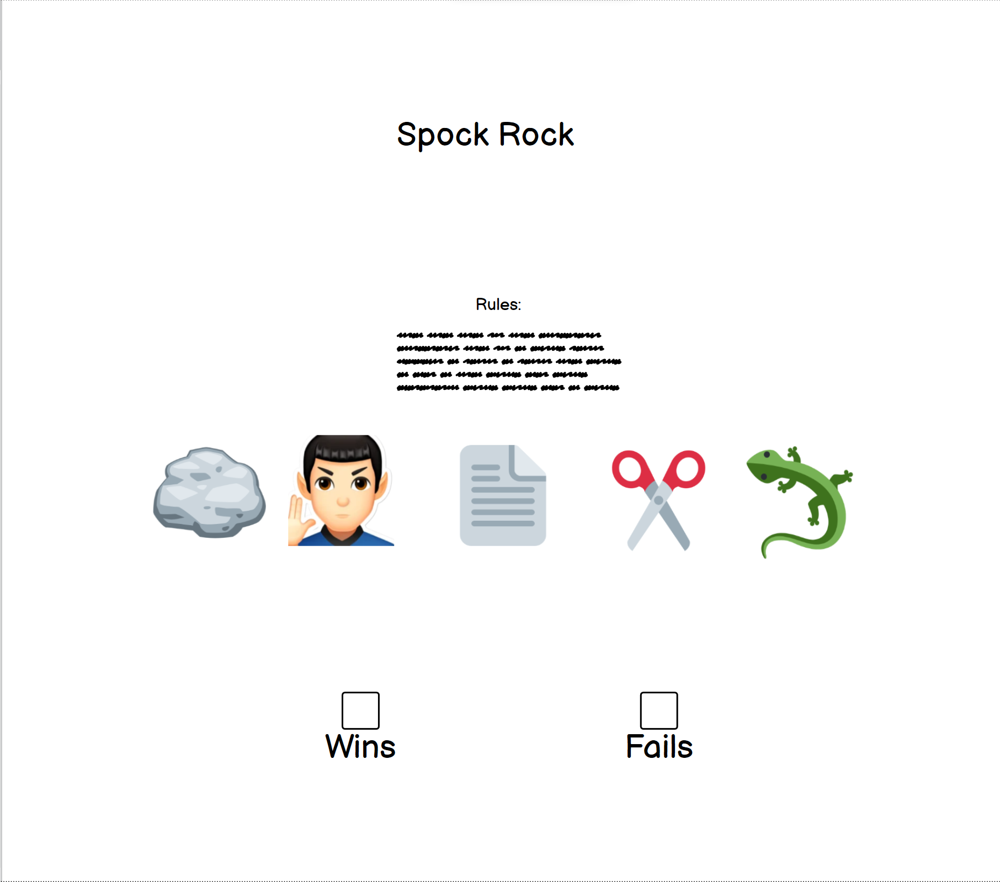

## UX 

### User stories

HOMEPAGE

* As a user I want the page to be easy to navigate.
* As a user I want to know what the site is about so I know what to expect from it.

# Features #
## Navigation ##
* The navigation is in a font that is modern and a color that contrasts with the background.
* The navigation clearly tells the user the name of the gamme and makes the different sections of information easy to find.
## The Header ## 
* The header explains the name of the game.

## Future Features ##

* In the future I would like to add more versions.

# Typography and color scheme #
## Font ##
* Aboreto and Rajdhani were used as a font as they give a fun look to the page.
 ## Color scheme ##
* Primary colors were used on the buttons to enhance the fun look.

## Wireframes ##

## Technologies

### Languages used

- [HTML](https://en.wikipedia.org/wiki/HTML5) - Add content and formatting to web page.

- [CSS](https://en.wikipedia.org/wiki/CSS) - Add styling and colours to web page.

- [JavaScript] (https://en.wikipedia.org/wiki/JavaScript) - Add interactive features to web page.

### Frameworks, Libraries and Programs Used

- [Gitpod](https://gitpod.io/) - web-based editor optimised for debugging, testing, syntax highlighting and extension support

- [Git](https://git-scm.com/) - used to allow for tracking of any changes in the code and for the version control.

- [Github](https://github.com/) - used to host the project files and host webpage onto the internet

- [Fontawesome](https://fontawesome.com/) - to insert icons in the website to make site more visually appealing and easy to navigate.

- [Google Fonts](https://fonts.google.com/) - used to import fonts in the style.css stylesheet.

- [Favicon] (https://favicon.io/) - to insert icons in the website to make site more visually appealing.

## Testing

 ## Lighthouse

  ## Test cases
 ### Index Page

## Responsiveness
 [Am I Responsive?](http://ami.responsivedesign.is/#) was used to check responsiveness of the site pages across different devices.
 
 The site has been tested on various sizes such as those listed below.
 
 Mobile:
 375x667 / 360x740 / 412x915 / 414x896
 
 Tablet:
 768x1024 / 820x1180 / 912x1368 
 
 Monitor:
 1280x1024 / 1600x900 / 2560x1440 / 3440x1440
 
 ### Manual Testing

* Browser Compatibility

     Browser | Outcome | Pass/Fail 
     --- | --- | ---
     Google Chrome | No appearance, responsiveness nor functionality issues.| 0
     Safari | No appearance, responsiveness nor functionality issues. | 0
     Microsoft Edge | No appearance, responsiveness nor functionality issues. | 0
     Firefox | No appearance, responsiveness nor functionality issues. | 0
     
 * Device compatibility

     Device | Outcome | Pass/Fail
    --- | --- | ---
    Laptop | No appearance, responsiveness nor functionality issues. | 0
    ipad mini | No appearance, responsiveness nor functionality issues. | 0
    Lenovo M1 Tab | No appearance, responsiveness nor functionality issues. | 0
    Samsung s20 | No appearance, responsiveness nor functionality issues. | 0
    iphone 12 pro | No appearance, responsiveness nor functionality issues. | 0

## Deployment
 
 ### Github

This website was published using GitHub Pages.
* Navigate to [GitHub](https://github.com/) and log in.
* Navigate to your repositories and find the project you want to deploy
* Under the name of your chosen Repository you will see a ribbon of selections, click on 'Settings' located on the right hand side.
* Scroll down till you see 'Pages' heading on the left hand side
* Under the 'Source' click on the dropdown and select 'master' or 'main' branch and click save
* The page will reload and you'll see the link of your published page displayed under 'GitHub' pages.
* It takes a few minutes for the site to be published, wait until the background of your link changes to a green color before trying to open it.
* Congratulations you have deployed your project!
 
 This website was written on Gitpod.
 
 ### Gitpod
* Navigate to [Gitpod] through [GitHub](https://github.com/), [GitLab](https://www.gitlab.com/) or [Bitbucket](https://bitbucket.org/).
* In the browser’s address bar, prefix the entire URL with gitpod.io/# and press Enter.
* For example, gitpod.io/#https://github.com/gitpod-io/website.
* We recommend you install the Gitpod browser extension to make this a one-click operation.
* Sign in with one of the listed providers and let the workspace start up.
* Congratulations, you have started your first of many ephemeral developer environments!

##Credits

###Media

###Content
-[Aboreto - Google Font] (https://fonts.google.com/specimen/Aboreto?query=Abore)

- [Rajdhani - Google Font] (https://fonts.google.com/specimen/Rajdhani?query=raj)
