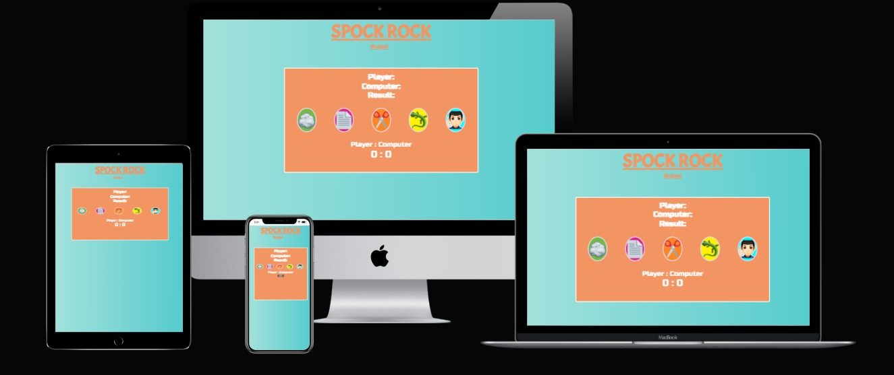
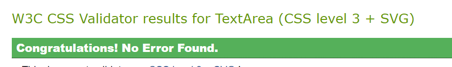
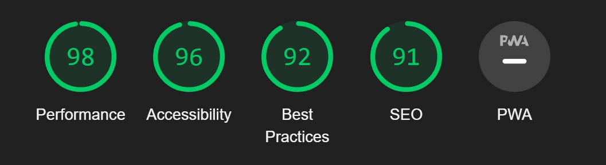

---

:desktop_computer: [Live Website] (https://eleanorbucke21.github.io/spock-rock-paper-sissors/)

:open_file_folder: [Github Repository] (https://github.com/eleanorbucke21/spock-rock-paper-sissors)

---

## TABLE OF CONTENTS

* [Automated Testing and Validation](#automated-testing-and-validation)
    * [HTML Validation](#html-validation)
    * [CSS Validation](#css-validation)
    * [Lighthouse](#lighthouse)
    * [Responsiveness](#responsiveness) 
* [Manual Testing](#manual-testing)
    * [Test Cases](#test-cases)

---

## <strong>Testing</strong>
- [W3C Markup Validation Serice](https://validator.w3.org/) was used to test for error codes in the HTML.
- [W3C CSS Validator](https://jigsaw.w3.org/css-validator/)  was used to test for error codes in the CSS.
- [Chrome DevTools](https://developer.chrome.com/docs/devtools/)
    was used during the development process to test, debug, explore and modify HTML elements, and to test responsiveness in different screen sizes.
-[JSHint](jshint.com) was used to test for error codes in the JavaScript.
- [Lighthouse](https://developer.chrome.com/docs/lighthouse/overview/) was used for improving the quality of web page. It has audits for performance, accessibility, progressive web apps, SEO, and more.

## Automated Testing and Validation
### HTML Validation
We used [W3C Markup Validation Service](https://validator.w3.org/) to validate all the HTML files by direct input:
|Page |Pass/Fail |  Results |
| ------------- | ------------- |------------- |
| Index | :heavy_check_mark: ||

### CSS Validation
We used [W3C CSS Validation Service](https://jigsaw.w3.org/css-validator/) to validate all CSS files by direct input.

|Page | Pass/Fail  | Results |
| ------------- | ------------- |------------- |
| assets/css/stylesheet.css | :heavy_check_mark: ||
 

## Lighthouse
### Index Page
  

      

## Responsiveness
[Am I Responsive?](http://ami.responsivedesign.is/#) was used to check responsiveness of the site pages across different devices.
 
 The site has been tested on various sizes such as those listed below.
 
 <strong>Mobile:</strong>
 375x667 / 360x740 / 412x915 / 414x896
 
 <strong>Tablet:</strong>
 768x1024 / 820x1180 / 912x1368 
 
<strong>Monitor:</strong>
 1280x1024 / 1600x900 / 2560x1440 / 3440x1440

  

## Manual Testing
Browser Compatibility:

Browser | Outcome | Pass/Fail 
 --- | --- | ---
Google Chrome | No appearance, responsiveness nor functionality issues.| :heavy_check_mark:
Safari | No appearance, responsiveness nor functionality issues. | :heavy_check_mark:
Microsoft Edge | No appearance, responsiveness nor functionality issues. | :heavy_check_mark:
Firefox | No appearance, responsiveness nor functionality issues. | :heavy_check_mark:

 

Device compatibility:

Device | Outcome | Pass/Fail
--- | --- | ---
Laptop | No appearance, responsiveness nor functionality issues. | :heavy_check_mark:
ipad mini | No appearance, responsiveness nor functionality issues. | :heavy_check_mark:
Lenovo M1 Tab | No appearance, responsiveness nor functionality issues. | :heavy_check_mark:
Samsung s20 | No appearance, responsiveness nor functionality issues. | :heavy_check_mark:
iphone 12 pro | No appearance, responsiveness nor functionality issues. | :heavy_check_mark:
            
## Test Cases

| Input | Output | Pass/Fail |
|--- | --- | --- |
| Clicked on Rules in header when it was closed. | It went opened the Popup. | :heavy_check_mark:
| Clicked on Rules when popup in header when it was open. | It closed the popup | :heavy_check_mark:
| Clicked rock | It played rock | :heavy_check_mark:
| Clicked paper | It played paper | :heavy_check_mark:
| Clicked scissors | It played scissors | :heavy_check_mark:
| Clicked lizard | It played lizard | :heavy_check_mark:
| Clicked spock | It played spock | :heavy_check_mark:
